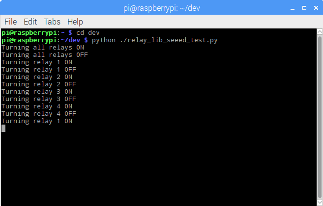

# Seed Studio Relay Board

I had an idea for a project, a Raspberry Pi-based power controller for my media center. I searched around for relay boards, and discovered the [Seeed Studio Raspberry Pi Relay Board v1.0](https://www.seeedstudio.com/Raspberry-Pi-Relay-Board-v1.0-p-2409.html), so I thought I'd give it a try.

> **Note**: At the time, this was the only directly-mountable relay board I could find for the Raspberry Pi. Since then, I found another one in the [ModMyPi PiOT Relay Board](https://www.modmypi.com/raspberry-pi/breakout-boards/modmypi/modmypi-piot-relay-board). I'll play with that one soon and publish my findings on [wwwjohnwargo.com](http://johnwargo.com); stay tuned.

When I finally got around to playing with the hardware, I used (or should I say tried to use) Seeed Studio's [Wiki Page for the board](http://wiki.seeed.cc/Raspberry_Pi_Relay_Board_v1.0/) to guide my efforts. Unfortunately, I quickly learned that the article was incomplete and didn't have everything I needed to work with the board. I mounted the board on my Raspberry Pi, powered it up, ran their sample test application, and got nowhere. It didn't work.

I sent Seeed Studios an email asking for help and posted a couple of questions on their community forums, but had to wait more than a month to get a response. After another week of sending them screen shots, I finally got useful information and was able to get the board operational. The purpose of this Github repository is to share with you the code Seeed provides to test the board (so that you can grab it using `git` rather than copying and pasting it from a Wiki page) plus a Python module (and associated test application) you can leverage to use the relay board on the Raspberry Pi. the rest of the information, such as how to mount the board, set the switches, troubleshoot the board, and more, I'll publish in an article on [www.johnwargo.com](http://www.johnwargo.com) describing everything. 

The steps for installing the board and verifying that it works includes the following steps (all described in detail in the [article on my blog]()):

1.	Mount the Relay board on the Raspberry Pi
2.	Enable the Raspbian I2C software interface
3.	Validate that the Raspberry Pi recognizes the board
4.	Run some Python code to exercise the board 

In the repository, you'll find three files:

+	`seeed_relay_test.py` - This is the sample application found on the [Seeed Studio Relay board Wiki page](http://wiki.seeed.cc/Raspberry_Pi_Relay_Board_v1.0/). When you run this application on your Pi (with the relay board connected, of course), you'll type commands in the terminal window to turn relays on and off. Refer to the Wiki page for details. 
+	`relay_lib_seeed.py` - A Python module that exposes several functions you can use in your own Python applications to control the relay board. The module is covered in the next section.
+	`relay_lib_seeed_test.py` - This is a sample Python application I wrote to exercise the module and validate that everything works.

## Using the Python Module

To use the module in your own Python applications, copy the module (`relay_lib_seeed.py`) into your project folder, then import the module in your Python application by adding the following line to the beginning of your application:

	from relay_lib_seeed import *

This exposes a series of functions to your application:

+	`relay_on(int_value)` - Turns a single relay on. Pass an integer value between `1` and `4` (inclusive) to the function to specify the relay you wish to turn on. For example: `relay_on(1)` will turn the first relay (which is actually relay `0` internally) on.
+	`relay_off(int_value)` - Turns a single relay on. Pass an integer value between 1 and 4 (inclusive) to the function to specify the relay you wish to turn on. For example: `relay_on(4)` will turn the first relay (which is actually relay `3` internally) off.
+	`relay_all_on()` - Turns all of the relays on simultaneously.    
+	`relay_all_off()` - Turns all of the relays off simultaneously.

The module exposes a configuration value you will want to keep in mind as you work with the board:

	DEVICE_ADDRESS = 0x20  # 7 bit address (will be left shifted to add the read write bit)

The board defaults to this address, but if you change the switches on the board, you will need to update this variable accordingly. I don't know at this time how to do that, but hopefully I can either get the folks at Seeed Studio to update the Wiki or I can figure this out on my own. Stay tuned.

To see the module in action, open a terminal window on the Raspberry Pi, navigate to the folder where you extracted this repository's files, and execute the following command:

	python ./relay_lib_seeed_test.py

The application will:

+	Turn all of the relays on for a second
+	Turn all of the relays off
+	Cycle through each of the relays (1 through 4) turning each on for a second

The module will write indicators to the console as it performs each step as shown in the following figure: 

LEDs on the relay board (one for each relay) will illuminate when the relays come one. On my board, they weren't in sequence, so don't expect them to light in order.

The code that does all this looks like the following:  

 	# turn all of the relays on
    relay_all_on()
    # wait a second
    time.sleep(1)
    # turn all of the relays off
    relay_all_off()
    # wait a second
    time.sleep(1)

    # now cycle each relay every second in an infinite loop
    while True:
        for i in range(1, 5):
            relay_on(i)
            time.sleep(1)
            relay_off(i)

That's it, that's all there is to it.

***

If you find this code useful, and feel like thanking me for providing it, please consider making a purchase from [my Amazon Wish List](https://amzn.com/w/1WI6AAUKPT5P9). You can find information on many different topics on my [personal blog](http://www.johnwargo.com). Learn about all of my publications at [John Wargo Books](http://www.johnwargobooks.com). 

